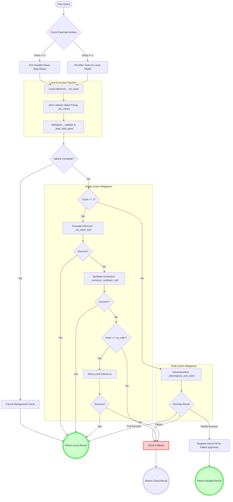

# Hybrid Inference Architecture
**File**: `main.py`

The hybrid inference system (`generate_hybrid`) is designed to favor the local model (FunctionGemma) mathematically by employing a **Speculative Edge Cascade** approach. It attempts multiple strategies to derive a valid result locally before relying on the cloud (Gemini).

## Architecture Flow

## Detailed Steps

### 1. Complexity Analysis & Cloud Speculation
*   **Action Estimation:** The system estimates how many distinct actions/tool calls the query contains (`_count_expected_actions`) by splitting on conjuncts like "and".
*   **Parallel Cloud Speculation:** If the query implies multiple actions (higher risk for SLMs), it immediately kicks off a background request to the Cloud API to run in parallel. This ensures minimal latency if the local model fails later on.
*   **Tool Filtering:** For simpler, single-action queries, it optimizes the local model's prompt by pre-filtering the available tools based on keyword relevance (`_tool_relevance`), vastly reducing the local model's selection space.

### 2. Initial Local Inference (Step 1)
*   It executes the request against the local FunctionGemma model (`_run_local`).
*   It implements robust parsing capable of recovering function calls even from broken JSON outputs commonly produced by the small local model (e.g., Chinese colons, stray escape tags, leading zeros).

### 3. Zero-Latency Value Fixing (Step 2)
*   Runs a heuristic engine (`_fix_values`) to aggressively fix common local model hallucinations and formatting errors *without* requiring a second model pass.
*   Fixes include turning negative integers positive, parsing alarm/timer times directly from the query via regex, dropping conversational filler text (e.g., "play some *jazz music*" ➔ "jazz"), and stripping trailing punctuation.

### 4. Validation & Early Acceptance (Steps 3 & 4)
*   **Structural Validation:** (`_validate`) Ensures all required arguments exist and types match.
*   **Argument Quality:** (`_args_look_good`) Ensures the local model didn't hallucinate emails, locations, or names that weren't present in the original query.
*   **Success:** If the calls are valid and the expected number of actions are satisfied, the local result is accepted instantly, and any speculatively running background cloud requests are cancelled. 

### 5. Focused Single-Action Mitigations (Steps 4.5 & 4.6)
*   **Iterative Retry:** For single-action queries that failed, it iterates through the top matching tools individually (`_try_each_tool`), providing the tool description in an augmented prompt to bridge semantic gaps.
*   **Heuristic Extraction:** If the model still yields no calls, it falls back to a "synthetic caller" (`_construct_synthetic_call`) which attempts to programmatically map the query words to the tool schema using Regex—completely bypassing the local LLM.

### 6. Decomposition for Multi-Action Queries (Step 5)
*   If a complex multi-action query fails or is partially successful locally, the query is split into smaller segments (`_decompose_and_solve`), propagating pronouns across segments (e.g., "message Alice and remind *her*...").
*   It attempts to solve each segment individually with the local model.
*   **Partial Cloud Fill:** If some segments succeed locally but others fail, it sends *only the failed segments* to the cloud, merging the subsequent cloud results with the successful local calls.

### 7. Cloud Fallback (Step 7)
*   If all local mitigations, structural repairs, and synthetic extractions fail, the system defaults to the cloud result.
*   It seamlessly retrieves the result from the parallel cloud request (if it was a multi-action query) or synchronously requests it, returning the `cloud (fallback)` result.
