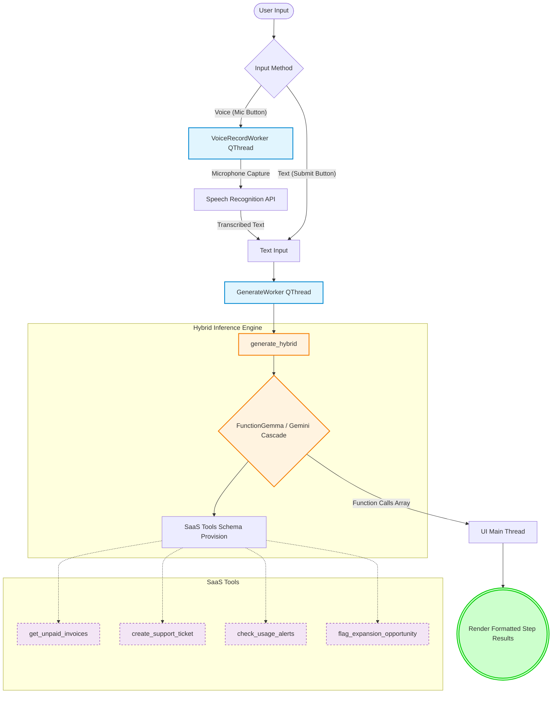

# SaaS Copilot Assistant Architecture
**File**: `saas_assistant.py`

The `saas_assistant.py` script runs a complete, desktop-based graphical user interface (GUI) designed to demonstrate the real-world application of the hybrid inference system (`generate_hybrid`). It represents a "Smart API Assistant" or "SaaS Copilot" that can map natural language requests (both typed and spoken) into actionable enterprise tool calls.

## Component Breakdown

1. **Modern Glassmorphic UI**: Built with PyQt6, the interface provides a premium desktop experience. It features frameless custom window dragging, shadows, radial gradients, and fluid hover animations.
2. **Audio Transcription**: It utilizes the `SpeechRecognition` library to capture audio via the microphone and relies on Google's speech recognition to instantly convert spoken requests into text, freeing the system from heavy local audio-processing dependencies.
3. **Asynchronous Threading**: To keep the UI responsive, both the audio processing (`VoiceRecordWorker`) and the LLM inference (`GenerateWorker`) are offloaded into separate `QThread` components.
4. **SaaS Tool Schema**: The application maintains a discrete set of simulated SaaS tools representing standard enterprise APIs, including identifying unpaid invoices, opening support tickets, and flagging expansion opportunities.
5. **Hybrid Backend Integration**: The script imports and invokes the primary `generate_hybrid` pipeline, feeding the user's extracted query and the SaaS schemas into the inference cascade, before cleanly formatting the resulting outputs sequentially in the UI.

## Architecture Flow

